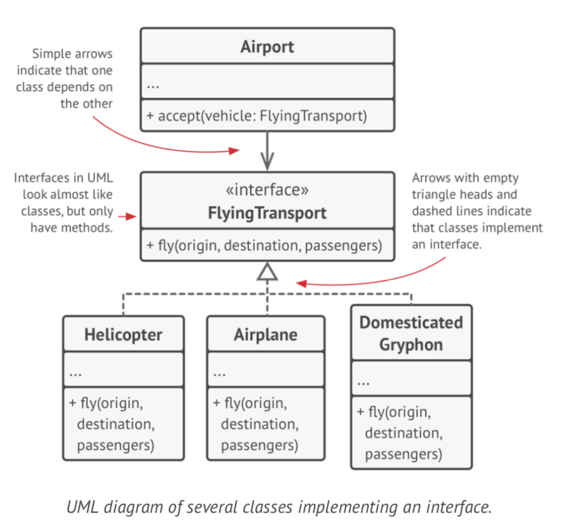
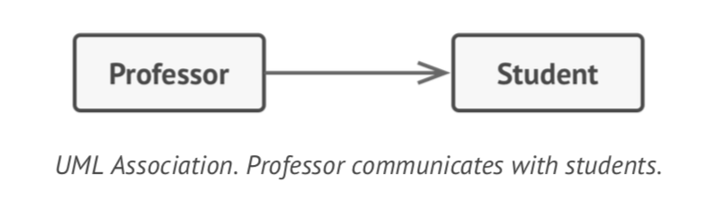
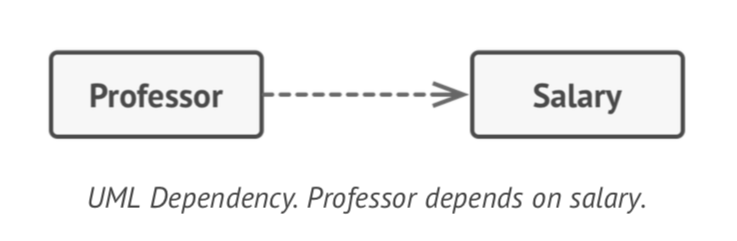
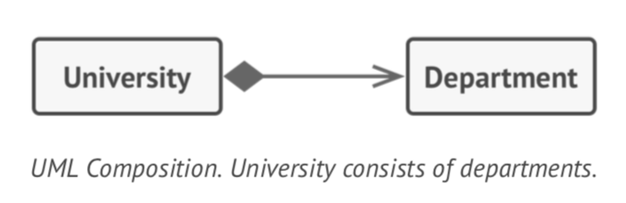
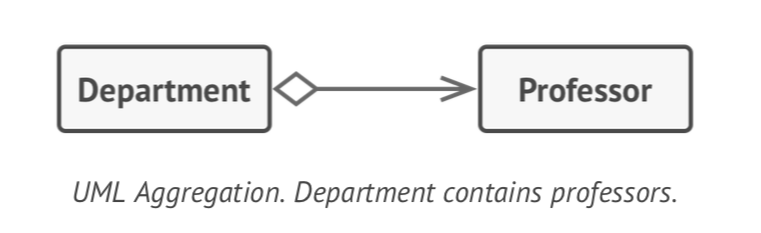

# UML - Unified Modeling Language  #

The Unified Modeling Language (UML) is a general-purpose, developmental, modeling language in the field of 
software engineering that is intended to provide a standard way to visualize the design of a system.

There are many options to design UML artifacts. For my ReadMe file, I've used
[Visual Paradigm](https://www.visual-paradigm.com/).

***

#### The pillars of OOP ####

Throughout the ReadMe file, I've briefly explained the 4 pillars of Object-Oriented Programming (OOP):

* Abstraction;
* Encapsulation;
* Inheritance;
* Polymorphism.

On this current file, I will introduce some of the esential UML language while providing additional information
on the pillars of OOP. This analysis is highly influenced by the book **"Dive Into Design Patterns"** by 
Alexander Shvets, who I should credit for the following diagrams.

[1] **Abstraction**

Abstraction is a model of a real-world object or phenomenon, limited to a specific context, which represents 
all details relevant to this context with high accuracy and omits all the rest.

[2] **Encapsulation**

Encapsulation is the ability of an object to **hide** parts of its state and behaviors from
other objects, exposing only a limited **interface** to the rest of the program.

To encapsulate something means to make it private (only accessible from within the methods
of its own class). There's a little bit less restrictive mode called "protected" that makes
a member of a class available to subclasses as well.

Interfaces and abstract classes/methods of most programming languages are based on the concepts
of abstraction and encapsulation.

[3] **Inheritance**

Inheritance is the ability to **build new classes on top of existing ones**. The main benefit of inheritance is code reuse. 
If you want to create a class that’s slightly different from an existing one, there’s no need to 
duplicate code. Instead, you extend the existing class and put the extra functionality into a 
resulting subclass, which inherits fields and methods of the superclass.

If a superclass implements an interface, all of its subclasses must also implement it.

However, you should [favor composition over inheritance](https://www.thoughtworks.com/insights/blog/composition-vs-inheritance-how-choose).

[4] **Polymorphism**

Polymorphism is the ability of a program to detect the real class of an object and call its 
implementation even when its real type is unknown in the current context.

However, this article explains [why extends is evil](https://www.infoworld.com/article/2073649/why-extends-is-evil.html).

***

[5] **Relations between objects**

* Association - Association is a type of relationship in which one object **uses or interacts** with another. 
In UML diagrams the association relationship is shown by a simple arrow drawn from an object and 
pointing to the object it uses.

* Dependency - Dependency is a weaker variant of association that usually implies that there’s **no permanent 
link** between objects. a dependency exists between two classes if changes to the definition of one class results 
in modifications in another class.

* Composition (strict relationship 1:*) - the instances contained in the collection are deleted if the instance that 
contains the collection gets deleted.

* Aggregation (less strict relationship 1:*) - one object merely contains a reference to another. 
The container doesn’t control the life cycle of the component. The component can exist without the container 
and can be linked to several containers at the same time.

